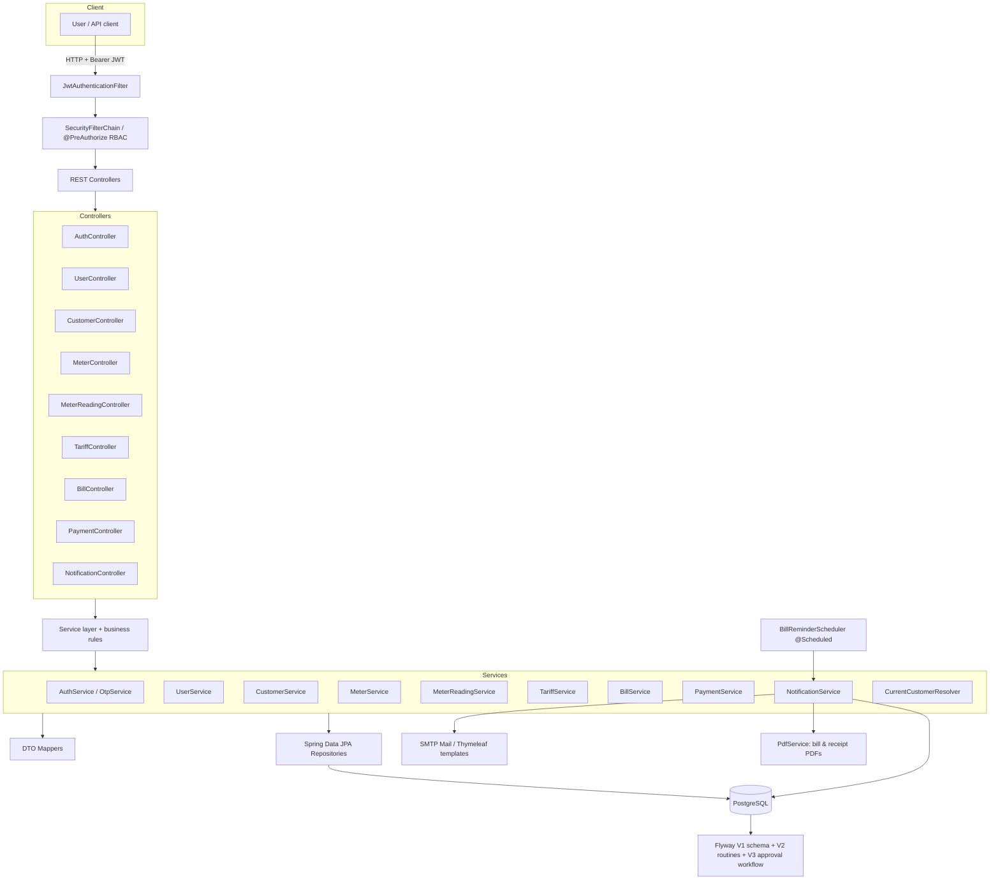
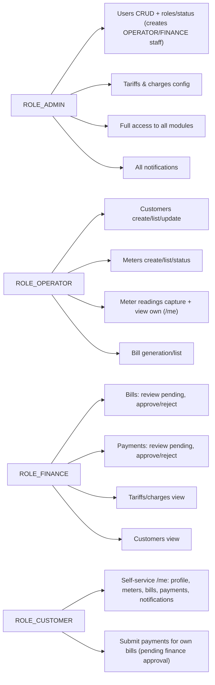
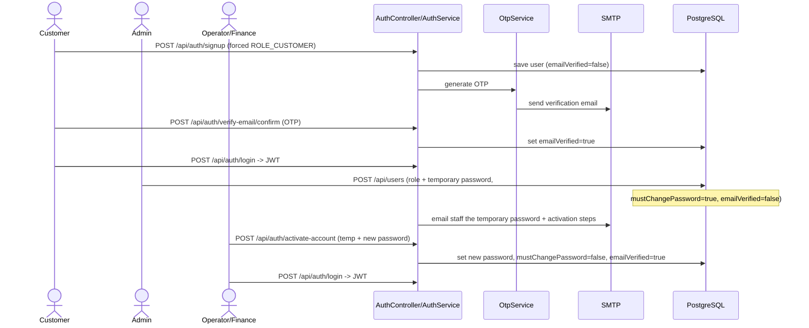
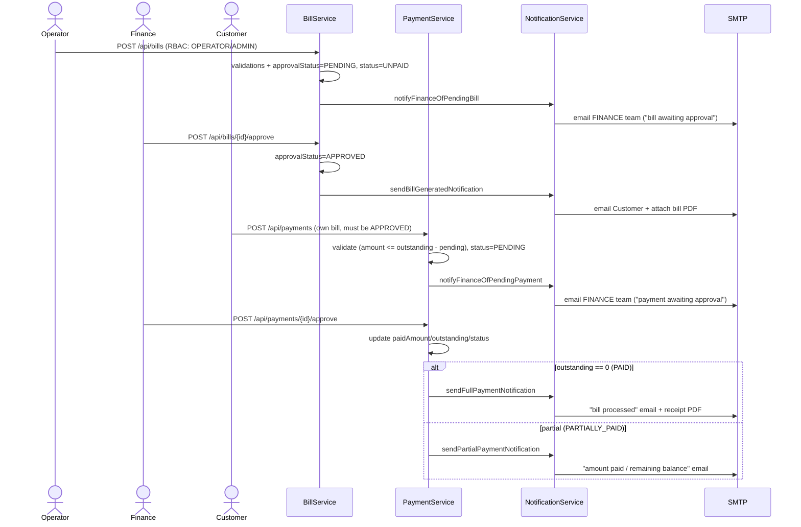

# WASAC Utility Billing — Architecture & Flow

The backend is a layered Spring Boot application. Every request (except the public
`/api/auth/**` endpoints and Swagger/actuator) passes the JWT filter, is authorized by
role with `@PreAuthorize`, then flows controller → service → repository → PostgreSQL,
with notifications fanned out to the database and SMTP.

## 1. Layered components

## 2. Role → capability flow

> **Onboarding rule:** only `ROLE_CUSTOMER` can self-register via `POST /api/auth/signup`.
> OPERATOR / FINANCE / ADMIN accounts are created by an admin (`POST /api/users`) with a
> temporary password; the new staff member must call `POST /api/auth/activate-account`
> to set their own password before they can log in.

## 3. Authentication & onboarding flow

Self-registering customers verify by OTP; admin-created staff activate by replacing a
temporary password.

## 4. Billing & payment flow (finance approval gated)

A bill is created PENDING and is invisible/non-payable to the customer until **finance
approves** it; only then is the customer emailed the bill PDF. A customer's payment is
recorded PENDING and does not change the balance until **finance approves** it; only then
is the customer emailed the partial-balance update or the full-payment receipt PDF.

> The V2 DB routines (`trg_bill_insert_notification`, `process_full_payment`) still exist
> as required database-level trigger/procedure/cursor artifacts; the application-level
> approval workflow above is what drives customer-facing emails and PDFs.

## 5. Request lifecycle (every secured call)

1. Client sends request with `Authorization: Bearer <JWT>`.
2. `JwtAuthenticationFilter` validates the token and loads the user's authority (`ROLE_*`).
3. `SecurityFilterChain` permits `/api/auth/**`, Swagger and actuator; everything else requires authentication.
4. `@Valid` validates the request body (→ `400` via `GlobalExceptionHandler`).
5. `@PreAuthorize` enforces the role matrix (→ `403` on denial).
6. The service applies business rules; `CurrentCustomerResolver` maps a `ROLE_CUSTOMER` principal to their `Customer` by email for `/me` endpoints.
7. Repositories persist via JPA; Flyway owns the schema and the V2 trigger/procedure/cursor routines.
8. `NotificationService` writes a notification row and sends an SMTP email rendered from Thymeleaf templates.
9. The service maps entities to response DTOs (no lazy proxies leak to JSON) and the controller wraps them in `ApiResponse`.
