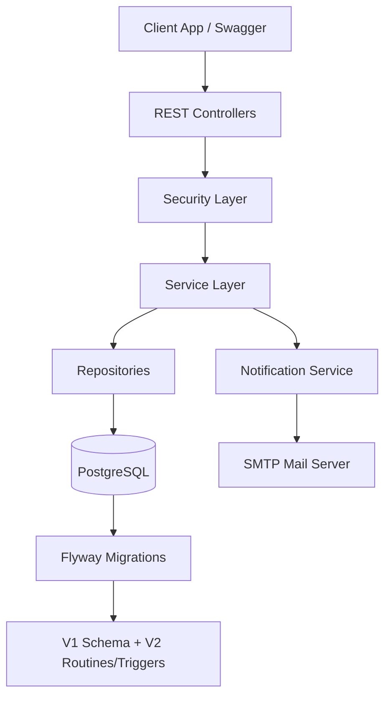

# WASAC Utility Billing Architecture

## Runtime Flow

- Request hits controller and passes through JWT filter.
- `@PreAuthorize` validates RBAC by user role.
- Service layer enforces business rules (meter status, reading rules, payment rules, tariff versioning).
- JPA persists to PostgreSQL with Flyway-managed schema.
- Notification service writes DB notification and sends SMTP email.
