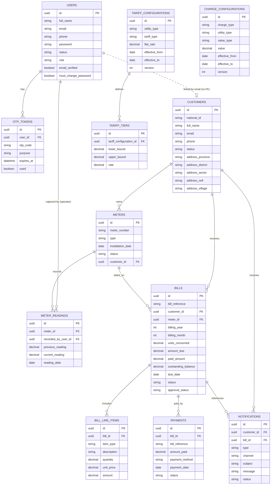

# WASAC ERD

> Schema status: **changed by `V3__approval_workflow.sql`.** The approval-workflow work
> added columns: `users.must_change_password`, `meter_readings.recorded_by_user_id`
> (FK → users), `bills.approval_status`, and `payments.status`. `V1__init_wasac_schema.sql`,
> `V2__database_routines.sql` and `V3__approval_workflow.sql` together are the source of truth.



## Notes on relationships

- **`USERS` ↔ `CUSTOMERS` (email-based link, no foreign key).** A login account
  (`USERS`) and a billed party (`CUSTOMERS`) are separate concepts. A `ROLE_CUSTOMER`
  user is matched to their `CUSTOMERS` record by equal `email`. This is why the
  self-service endpoints (`/api/customers/me`, `/api/meters/me`, `/api/bills/me`,
  `/api/payments/me`, `/api/notifications/me`) resolve the current customer from the
  authenticated principal's email. Create the customer with the same email as the
  customer's login account for these endpoints to resolve.
- **`CHARGE_CONFIGURATIONS`** is a standalone, versioned configuration table (VAT,
  fixed service charges, penalties). It is not linked by FK to bills; charges are
  applied at bill-generation time and captured as `BILL_LINE_ITEMS`.
- **Versioning.** `TARIFF_CONFIGURATIONS` and `CHARGE_CONFIGURATIONS` carry
  `version`, `effective_from`, `effective_to` and an `active` flag so new rates apply
  only to future billing cycles.
- **Approval workflow (V3).**
  - `users.must_change_password` — admin-created OPERATOR/FINANCE/ADMIN accounts start
    with a temporary password and `must_change_password = true`; they cannot log in until
    they activate their account and set their own password.
  - `meter_readings.recorded_by_user_id` — FK to the operator (USERS) who captured the
    reading, powering the operator's `GET /api/meter-readings/me` self-service view.
  - `bills.approval_status` — `PENDING` / `APPROVED` / `REJECTED`. A bill is only emailed
    to the customer and becomes payable once finance sets it to `APPROVED`.
  - `payments.status` — `PENDING` / `APPROVED` / `REJECTED`. A payment only updates the
    bill balance and notifies the customer once finance sets it to `APPROVED`.

## Schema migration (V3)

`V3__approval_workflow.sql` adds the approval-workflow columns and backfills any
pre-existing rows so they remain usable:

```sql
ALTER TABLE users ADD COLUMN must_change_password BOOLEAN NOT NULL DEFAULT FALSE;
ALTER TABLE meter_readings ADD COLUMN recorded_by_user_id UUID NULL REFERENCES users(id);
ALTER TABLE bills ADD COLUMN approval_status VARCHAR(20) NOT NULL DEFAULT 'PENDING';
UPDATE bills SET approval_status = 'APPROVED';
ALTER TABLE payments ADD COLUMN status VARCHAR(20) NOT NULL DEFAULT 'PENDING';
UPDATE payments SET status = 'APPROVED';
```

## Database routines (V2)

| Routine | Type | Behaviour |
|---------|------|-----------|
| `set_updated_at_timestamp()` | Trigger function | Sets `updated_at = NOW()`; wired to `trg_*_updated_at` BEFORE UPDATE triggers on users, customers, meters, tariff_configurations, charge_configurations, bills |
| `insert_bill_notification()` + `trg_bill_insert_notification` | Trigger | AFTER INSERT on `bills`, writes a `BILL_GENERATED` notification row |
| `process_full_payment(...)` | Stored function with a **CURSOR** | Records the payment, updates balance/status to `PAID`/`PARTIALLY_PAID`, iterates overdue bills via `overdue_cursor` to emit `OVERDUE_REMINDER` notifications, and writes a `PAYMENT_COMPLETED` notification when fully paid |

Inspect them in PostgreSQL:

```sql
-- list triggers
SELECT tgname, relname FROM pg_trigger t JOIN pg_class c ON c.oid = t.tgrelid WHERE NOT t.tgisinternal;
-- list functions / procedures
SELECT proname, prokind FROM pg_proc WHERE pronamespace = 'public'::regnamespace;
-- view a routine body
\sf process_full_payment
```
