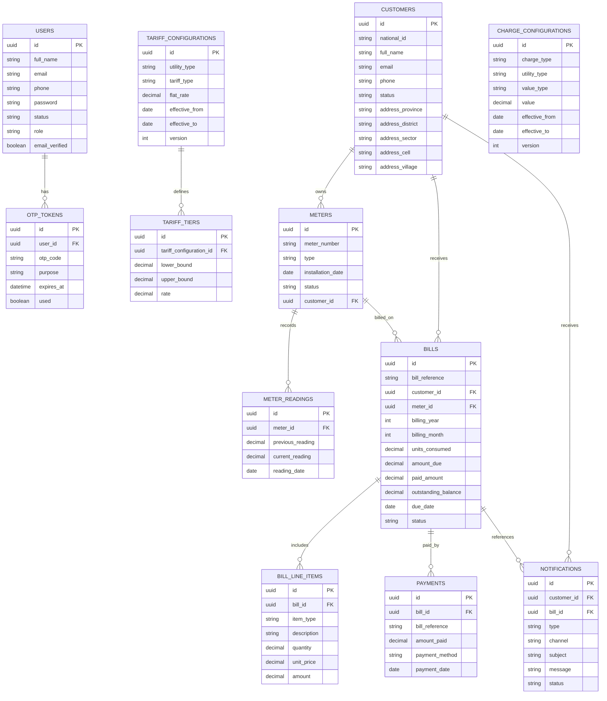

# WASAC ERD

```mermaid
erDiagram
    USERS ||--o{ OTP_TOKENS : has
    CUSTOMERS ||--o{ METERS : owns
    METERS ||--o{ METER_READINGS : records
    CUSTOMERS ||--o{ BILLS : receives
    METERS ||--o{ BILLS : billed_on
    BILLS ||--o{ BILL_LINE_ITEMS : includes
    BILLS ||--o{ PAYMENTS : paid_by
    CUSTOMERS ||--o{ NOTIFICATIONS : receives
    BILLS ||--o{ NOTIFICATIONS : references
    TARIFF_CONFIGURATIONS ||--o{ TARIFF_TIERS : defines

    USERS {
      uuid id PK
      string full_name
      string email
      string phone
      string password
      string status
      string role
      boolean email_verified
    }
    OTP_TOKENS {
      uuid id PK
      uuid user_id FK
      string otp_code
      string purpose
      datetime expires_at
      boolean used
    }
    CUSTOMERS {
      uuid id PK
      string national_id
      string full_name
      string email
      string phone
      string status
      string address_province
      string address_district
      string address_sector
      string address_cell
      string address_village
    }
    METERS {
      uuid id PK
      string meter_number
      string type
      date installation_date
      string status
      uuid customer_id FK
    }
    METER_READINGS {
      uuid id PK
      uuid meter_id FK
      decimal previous_reading
      decimal current_reading
      date reading_date
    }
    TARIFF_CONFIGURATIONS {
      uuid id PK
      string utility_type
      string tariff_type
      decimal flat_rate
      date effective_from
      date effective_to
      int version
    }
    TARIFF_TIERS {
      uuid id PK
      uuid tariff_configuration_id FK
      decimal lower_bound
      decimal upper_bound
      decimal rate
    }
    CHARGE_CONFIGURATIONS {
      uuid id PK
      string charge_type
      string utility_type
      string value_type
      decimal value
      date effective_from
      date effective_to
      int version
    }
    BILLS {
      uuid id PK
      string bill_reference
      uuid customer_id FK
      uuid meter_id FK
      int billing_year
      int billing_month
      decimal units_consumed
      decimal amount_due
      decimal paid_amount
      decimal outstanding_balance
      date due_date
      string status
    }
    BILL_LINE_ITEMS {
      uuid id PK
      uuid bill_id FK
      string item_type
      string description
      decimal quantity
      decimal unit_price
      decimal amount
    }
    PAYMENTS {
      uuid id PK
      uuid bill_id FK
      string bill_reference
      decimal amount_paid
      string payment_method
      date payment_date
    }
    NOTIFICATIONS {
      uuid id PK
      uuid customer_id FK
      uuid bill_id FK
      string type
      string channel
      string subject
      string message
      string status
    }
```
